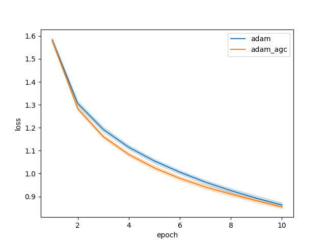

# AGC Optimizers

A small lib for using adaptive gradient clipping in your optimizer. Currently PyTorch only.

- [News](#news)
- [Introduction](#introduction)
- [Comparison](#comparison)
- [To Do](#todo)

## News

### Sep 14, 2021
* Add AdamW, Adam, SGD and RMSprop with AGC 
* Add first comparsion between optimizers with and without AGC based on CIFAR10

## Introduction

[Brock et al.](https://arxiv.org/pdf/2102.06171.pdf) introduced 2021 a new clipping technique in order to increase stability of large batch training and high learning rates in their Normalizer-Free Networks (NFNet), the adaptive gradient clipping. This clipping method is not implemented in leading frameworks, thus I provide optimizers which are capable of AGC. 

### Installation
```bash
pip install agc_optims
```

### Usage

To be consistent with PyTorch all arguments of the optimizer remain the same as in the standard. Only two parameters are added for the AGC:
* `clipping` : Hyperparameter for the clipping of the parameter. Default value 1e-2, smaller batch sizes demand a higher clipping parameter
* `agc_eps` : Term used in AGC to prevent grads clipped to zero, default value 1e-3

#### SGD
```python
from agc_optims.optim import SGD_AGC

net = Net() # your model

optimizer = SGD_AGC(net.parameters(), lr=0.01, momentum=0.9, clipping=0.16)
```
#### Adam
```python
from agc_optims.optim import Adam_AGC

net = Net() # your model

optimizer = Adam_AGC(net.parameters(), lr=0.001, weight_decay=1e-4, clipping=0.16)
```
#### AdamW
```python
from agc_optims.optim import AdamW_AGC

net = Net() # your model

optimizer = AdamW_AGC(net.parameters(), lr=0.001, weight_decay=1e-4, clipping=0.16)
```
#### RMSprop
```python
from agc_optims.optim import RMSprop_AGC

net = Net() # your model

optimizer = RMSprop_AGC(net.parameters(), lr=0.001, clipping=0.16)
```

Now you can use the optimizer just like their non-AGC counterparts.

## Comparison

The following comparison shows that for batch sizes 64 and 128 Adam with AGC performs better than the normal Adam. SGD is unfortunately worse with AGC, but the batch size is also very small compared to the NFNet paper. This requires more comparisons with higher batch sizes and also on other data sets. RMSprop is also better at both batch sizes with AGC than without. The learning rate was left at the default value for all optimizers and the scripts in the performance_tests folder were used as the test environment. 

Batch Size 64 - SGD Accuracy on Cifar10           |  Batch Size 64 - SGD Loss on Cifar10
:-------------------------:|:-------------------------:
  |  

Batch Size 128 - SGD Accuracy on Cifar10           |  Batch Size 128 - SGD Loss on Cifar10
:-------------------------:|:-------------------------:
  |  

Batch Size 64 - Adam Accuracy on Cifar10           |  Batch Size 64 - Adam Loss on Cifar10
:-------------------------:|:-------------------------:
  |  

Batch Size 128 - Adam Accuracy on Cifar10           |  Batch Size 128 - Adam Loss on Cifar10
:-------------------------:|:-------------------------:
  |  

Batch Size 64 - RMSProp Accuracy on Cifar10           |  Batch Size 64 - RMSProp Loss on Cifar10
:-------------------------:|:-------------------------:
  |  

Batch Size 128 - RMSProp Accuracy on Cifar10           |  Batch Size 128 - RMSProp Loss on Cifar10
:-------------------------:|:-------------------------:
  |  

As a little treat, I have also compared the speed of the optimizer with and without AGC to see whether this greatly increases training times. 

Batch Size 128 - RMSProp Accuracy on Cifar10           |  Batch Size 128 - RMSProp Loss on Cifar10
:-------------------------:|:-------------------------:
  |  

## To Do
- [x] Add first comparsion based on CIFAR10 with a small CNN
- [ ] Add comparsion with higher batch sizes (256,512,1024)
- [ ] Add tests for each optimizer
- [ ] Clipping == 0 no AGC
- [ ] Add comparsion based on CIFAR100 with a small CNN
- [ ] Add comparsion based on CIFAR10/100 with ResNet
- [ ] Add comparsion with ImageNet (I do not have enough GPU-Power currently if someone provides some tests I would be grateful)
- [ ] Add all optimizer included in PyTorch
- [ ] Support of other frameworks than PyTorch
- [ ] Add first comparsion based on CIFAR with a small CNN
  